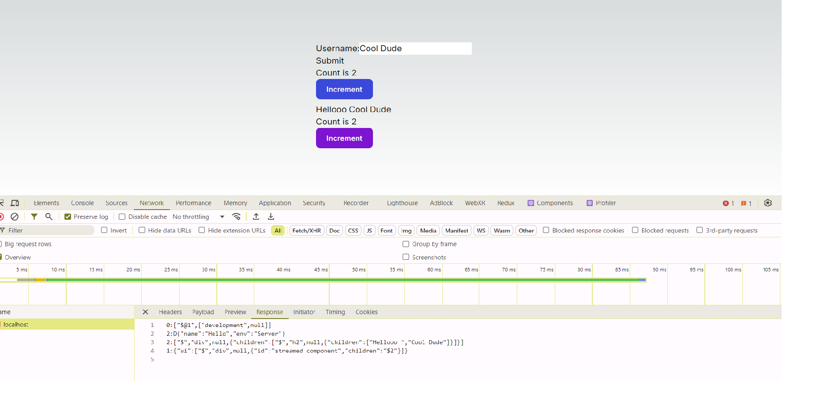
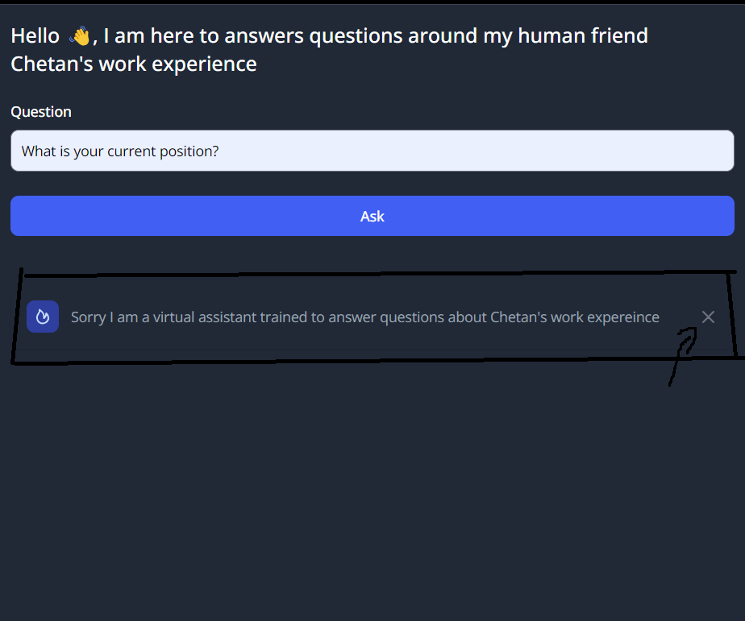

# Streaming Component via Server Action

Yes you read it right, we can stream components from server actions and with NextJs is pretty straight forward.

This is a [Next.js](https://nextjs.org/) project bootstrapped with [`create-next-app`](https://github.com/vercel/next.js/tree/canary/packages/create-next-app).

## Getting Started

First, run the development server:

```bash
npm run dev
# or
yarn dev
# or
pnpm dev
# or
bun dev
```

Open [http://localhost:3000](http://localhost:3000) with your browser to see the result.

## Streaming Component via Server Action

- In this new era of React and NextJS there are two type of components:

  1. Client Component - These are our old components, just re labeled as `client`. They are interactive and can use also the fancy hooks available. They render both in Server(render here) and Client(hydrate here). In NextJS every component by default is Server, so we have to explicitly add `use client` directive at the top of the component file to make it a client component.
  2. Server Component - These are new types of component that only render in Server side. When we say only render, its different than Server side rendering. In SSR we send a rendered HTML, while with Server component we send the React Element(Object) that is understood by the React and gets rendered on Page. This does not mean we don't SSR the Server component. Without SSR the element sent is in this format:

  ```js
  {\"children\":[[\"$\",\"h1\",null,{\"children\":\"Server Action streaming components example\"}]}
  ```

- If we try to stream a client component back as a response of server action as shown below

```js
export async function addPerson(data) {
  return {
    ui: (
      <div id="streamed component">
        <Hello /> // Pure Static component
        <Counter /> // Use useState
      </div>
    ),
  };
}
```

- We will get an error along this line.

```js
 ⨯ Error: Could not find the module "\stream-components-server-action\src\app\_components\counter.jsx#default" in the React Client Manifest. This is probably a bug in the React Server Components bundler.
```

- This simply means that we can only stream server component or simply put component that generates static html without any state update or client related hooks(anything that starts with use\*). Simple example shown below

```js
export async function addPerson(data) {
  return {
    ui: (
      <div id="streamed component">
        <Hello /> // Pure Static component
      </div>
    ),
  };
}
```

- With the above action our React element that is returned as `ui` will be passed as following:

  ```js
  0:["$@1",["development",null]]
  2:D{"name":"Hello","env":"Server"}
  2:["$","div",null,{"children":["$","h2",null,{"children":["Hellooo ","Test"]}]}]
  1:{"ui":["$","div",null,{"id":"streamed component","children":"$2"}]}
  ```

- This shows that we just pass the fully parsed React Element(object) which is basically an output of passing our component to `CreateElement`. We never get the`js` of that component in FE.
- This is super cool but wait, what if we need interactivity, there is no easy way around it. I tried the following ways to add an interactive component via server action but they all resulted in error, mentioned above:

  1. Use Custom Event for event handling
  2. Pass the interactive piece of the component as slot
  3. Use Context to wrap state and state update.

- So I came up with a work around that let's me add the interactive component either as a `first child` or the `last child` of the Server component after I receive the response. Its not similar to adding the siblings of the Server returned component but mutating it's children to add more elements.

  ```js
  const handleSubmit = async (e) => {
    e.preventDefault();
    const data = await addPerson(e.currentTarget.elements.username.value);
    // now we can append a new child either at top or at last of the strmaed response
    const originalChildren = data.ui.props.children;
    console.log({ originalChildren });
    // here we append a new children to the original element as a last child
    const CounterEl1 = <Counter base={true} />;
    const CounterEl2 = <Counter base={false} />;
    const ui = cloneElement(data.ui, {}, [
      CounterEl1,
      originalChildren,
      CounterEl2,
    ]);

    setResult({
      ui: ui,
    });
  };
  ```



- This is a simple example, but I have used this in my [portfolio](https://cdasauni.com) to Stream a Component that I create after the LLM response and then mutate it to add an interactive button to it.
  
